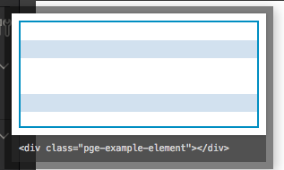

## Creating Components  
---
## Overview  
The ``` PgComponentType ``` constructor is the main way to add new snippets, property controls, and actions to the Pinegrow App. This constructor creates an object with a unique id, display name, and options that can be broken down into three sections.  

  1) A main body that contains key:value pairs that contain an optional HTML snippet, give information on how to identify the component for property controls or actions to target on the page, and data on how to display the element on the tree.  
  2) Objects passed through the ```sections``` key that identify one or more groups of property controls or actions.
  3) Objects passed through the ```fields``` key that are individual property controls or actions.
  
  How the component is added to the Pinegrow App depends on component type. For components that add property controls only, the component is added to the framework using ```addComponentType``` in conjunction with the ```addPrefix(plugin_id)``` function.
  ```javascript
  var my_property_control = new PgComponentType( 'my_control', 'My Control', {...} );
  my_property_control.addPrefix(plugin_id);
  framework.addComponentType(my_property_control);
  ```
  
  Components that add reusable HTML snippets or actions require an additional constructor, ```PgFrameworkLibSection```. This constructor creates a new panel that can be displayed in the Library or Actions Tab. Components for each panel are identified by passing an array of components using ```setComponentTypes```. This object is then added to the framework object using either ```addLibSection``` to pass it to the Library tab, or ```addActionsSection``` to display it on the Actions Tab.  

  Library panel addition example
  ```javascript
  var custom_lib_section = new PgFrameworkLibSection( 'pge_my_custom_section', 'My Custom Section');
  pge_custom_lib_section.setComponentTypes([my_custom_component_one, my_custom_component_two]);
  framework.addLibSection(custom_lib_section);
  ```
  or  
  Action panel addition example
  ```javascript
  var pge_custom_action_section = new PgFrameworkLibSection( 'pge_my_custom_section', 'My Custom Section');
  pge_custom_action_section.setComponentTypes([my_custom_component_one, my_custom_component_two]);
  framework.addActionsSection(pge_custom_action_section);
  ```
---  

### PgComponentType(unique_id, display_name, {options} )
This constructor is passed three arguments.

  * __unique_id__ An id that is unique within the plugin.

   * __display_name__ A name that is displayed in the library tab for the user to select to drag to the DOM. For components that add only property controls or actions this key can be passed an empty string. 

   * __{options}__ An object that contains the HTML, controls, and or actions. These options will be covered in more detail [in the {options} section](#okv) of this document.  
### addPrefix(plugin_id)  
This function is added as a key to the ```PgComponentType``` object. It adds prefixes to the unique_id of the component , as well as the sections and fields defined within the component. THis ensures that there aren't any conflicts with other plugins. This must be called before addition of the component using ```addComponentType```. It is passed a single argument.

  * __plugin_id__ An id unique to the plugin. It typically is the same as the plugin_id used when creating the framework.  

### addComponentType(component)  
This function adds the component defined by the ```PgComponentType``` constructor to the framework. It takes a single argument.

  * __component__ This argument is the name of the component object.

### PgFrameworkLibSection(unique_id, display_name)
This constructor creates a new object for addition to either the HTML snippet library or the actions panels. This object is created after individual components are defined using the ```PgComponentType``` constructor. It receives two arguments.

  * __uniqueID__ An id that is unique within the plugin and should be prefixed with the plugin_id to prevent conflicts.

  * __display_name__ A name that will be displayed as the title of the added section in the library or actions panel.

### setComponentTypes(components)
This function takes an array of component names (defined using the ```PgComponentType``` constructor) to be added to the section object created with the ```PgFrameworkLibSection``` constructor.

### addLibSection(section)
This function adds the passed section name to the library panel of the framework.

### addActionsSection(section)
This function adds the passed section name to the Actions panel of the framework.

---

<a name="okv"></a>
## PgComponentType {options}  
---
### Overview  
The options object of the ```PgComponentType``` constructor can be further split into key:value pairs that provide the main body of the component, a ```sections``` object that organizes all of the controls or actions, and a set of ```fields``` objects within the sections object that contain the key:value pairs that describe each control or action. Each component has a single set of main body options, but can have multiple sections with multiple fields each.  
 #### Main Body Key:Value Pairs
 ___  

**selector**  
This key receives either a CSS selector(s) or function that uniquely identifies the element being created or controlled. This key is required and is passed 'null' if the component does not need to be identified by Pinegrow - for example, a sub-component of a larger HTML element. When receiving a CSS selector, that selector is evaluated by Pinegrow to return a boolean value. Any function passed through the ```selector``` key should return a boolean.  
An example of a simple selector to target any page element with an attribute of 'pg-table'
```javascript
selector: '[pg-table]',
```  
An example targeting any element with a class of either 'container' or 'container-fluid'
```javascript
selector: '.container,.container-fluid',
```  
A example of a more complex selector using a javascript function. Note: the function can be passed a single argument that is conventionally named ```pgel```. This argument contains the source-code representation of the current DOM node (pgParserNode). This example function checks to see if the tag of the node is NOT 'html', 'body', 'head', or 'script'. As a side note, ```pgel.tagName``` will always return lowercase, irrespective of the case in the document.
```javascript
selector: function(pgel) {
	if (['html', 'body', 'head', 'script'].includes(pgel.tagName)) {
		return false;
	} else {
		return true;
	}
},
```
**priority**  
Determines the order in which an action or property control component will display in the panel. The default is 1000. This key is optional.  

**code**  
This key receives any reusable snippet - HTML, Javascript, PHP. This key is optional. If you are putting together a component consisting of controls or actions only it doesn't need to be added.   
An example passing both HTML and PHP. 
```javascript
code: '<h2>The title of this article is <?php the_title(); ?>.</h2>',
```
**preview**  
This key receives a function that returns HTML representing what will be shown if the user hovers over the snippet in the library. This code is automatically generated from the ```code``` key:value pair. However, in the case of elements such as containers or rows it is useful to have a visual representation. This key is optional.
```javascript
Other component code...
    preview: getGridPreview(),
remainder of component code...

var getGridPreview = function() {
	var white = 'height: 20px;';
	var blue = 'height: 20px; background-color: #D8E5F2;';
		return '<div class="container-fluid" style="border:2px solid #0098cc; height: 120px;">\
			<div class="row">\
				<div style="' + white + '"></div>\
				<div style="' + blue + '"></div>\
				<div style="' + white + '"></div>\
			</div>\
			<div class="row">\
				<div style="' + white + '"></div>\
				<div style="' + blue + '"></div>\
				<div style="' + white + '"></div>\
			</div>\
		</div>';
	}
```
This code results in the following being displayed when the user hovers over the element in the Library panel.  
  
Note: If the ```code``` key has a value it will be appended to the preview HTML.  

**empty_placeholder**  
This key takes a boolean value. If true, it will insert a temporary placeholder element into the code until the user adds content. This is generally used for containers or rows to make them more easily dragged or targeted for editing.  
```javascript
empty_placeholder: true,
```
**on_inserted**  
This key receives a function that is fired upon element insertion into the tree. This function takes two arguments, the DOM element (conventionally named 'pgel') and the page. One common use for this key is to display a message to the user or to refresh the page in the case of dynamic objects.  
```javascript
selector: '[slider]',
code: '...',
on_inserted: function(pgel, page) {
	crsaQuickMessage( 'Refresh page to see changes', 3000 );
},
...
```

**on_changed**  
This key receives a function that is fired upon alteration of the element. This function takes two arguments, the DOM element and the page. It will also fire if one of the element's descendants changes. One common use for this key is to display a message to the user or refresh the page in the case of dynamic objects.


Next: [Sections and Fields](Sections%20and%20Fields.md)