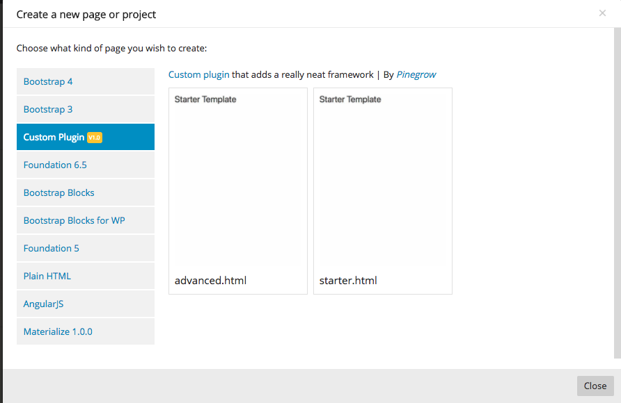

# Creating a Plugin
Pinegrow plugins are Javascript plugins that utilize the Pinegrow API to extend the capabilities of the editor. All Pinegrow plugins are instantiated by calling a function, either anonymous or named, once the Pinegrow App signals it is ready. This function gets passed the event and the ```pinegrow``` window variable as arguments.
```javascript
$(function() {
    $('body').one('pinegrow-ready', function(e, pinegrow) {
        //plugin body
    });
});
```
or
```javascript
$(function() {
    $('body').one('pinegrow-ready', function(e, pinegrow) {
        myFunctionName(pinegrow);
    });
});
function myFunctionName(pinegrow){
    //plugin body
};
```
Within the body of the plugin, a new framework object is created using the ```PgFramework``` constructor and passing in a unique key that will be prefixed internally, along with a name for the framework.
```javascript
var framework = new PgFramework(key, name);
``` 
This framework variable can then be populated with a variety of key:value pairs. Some of these pairs are informational, like ```framework.author```, which will be displayed to the end user, or give parameters to the Pinegrow App about how the plugin is supposed to be managed or displayed. The most important of these are listed below in the section [**framework descriptive elements**](#fde). Other pairs add the individual library components, items to the property panel, or actions panel. The most important of these are listed on the [**Components**](Components.md) and [**Sections and Fields**](Sections%20and%20Fields.md).  

Typically, the descriptive key:value pairs for the framework are defined prior to returning the new object to the Pinegrow App using the ```addFramework()``` function. In addition to passing in the framework variable, this function can also receive a second argument, ```weight``, which determines the order that the framework is displayed in the "New page or project" popup.

```javascript
pinegrow.addFramework(framework, 100);
```

<a name="fde"></a>
## Framework Descriptive Elements
___  
### __type__
This key takes a unique value identifying the framework - usually the same as the key passed into the framework, but can be used to delineate different versions of the same type. For example, all of the included versions of the Bootstrap framework has a type of 'bootstrap', but a key unique to their version - 'bs3.4.1' or 'bs4'. Defaults to the passed in key.
```javascript
framework.type = 'key';
```
### __allow_single_type__
This key takes a boolean value, usually "true", that prevents activation of multiple frameworks of the same type. Defaults to "false".
```javascript
framework.allow_single_type = true;
```
### __description__
This key takes an HTML string describing the plugin and can contain a link that is displayed when creating a new page using a template from the plugin.
```javascript
framework.description = '<a href="http://my.website.com/">Custom plugin</a> that adds a really neat framework';
```
### __author__
This key takes an HTML string with the author's name and is displayed when creating a new page using a template from the plugin.
```javascript
framework.author = '<em>Pinegrow</em>';
```
### __author_link__
This key takes a URL link that will be opened if the author name is clicked in the new page pop-up.
```javascript
framework.author_description = 'https://pinegrow.com';
```
### __info_badge__
This key takes a short string that will be displayed when creating a new page using a template from the plugin. This is useful for displaying version numbers, for example.
```javascript
framework.info_badge = 'v1.0.0';
```

Typical example of basic framework instantiation:
```javascript
$(function() {
    $('body').one('pinegrow-ready', function(e, pinegrow) {

        var framework = new PgFramework('pge', 'Pinegrow Example');

		framework.type = 'pge';
		framework.allow_single_type = true;

		framework.description = '<a href="http://my.website.com/">Custom plugin</a> that adds a really neat framework';
		framework.author = '<em>Pinegrow</em>';
		framework.author_description = 'https://pinegrow.com';
		framework.info_badge = 'v1.0';

        pinegrow.addFramework(framework, 100);

    });
});
```
As shown below, this descriptor information will only be displayed when creating a plugin that adds a template for the user to select when starting a new page or project. It will not be displayed if the plugin only adds HTML snippets, actions, modifies workflow, or adds to the CMS.  


Once your framework is created you can add optional templates and resources that are made available to the user. This is documented on the [Templates and Resources](Templates%20and%20Resources.md) page. Additionally, you can now begin adding [components](Components.md) and [sections and fields](Sections%20and%20Fields.md) that control page elements.
