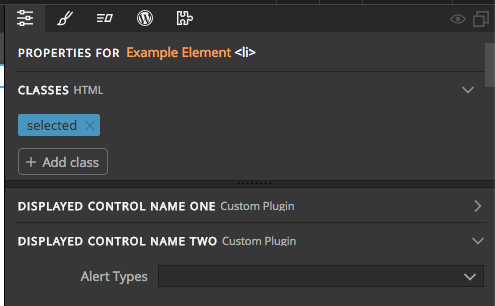
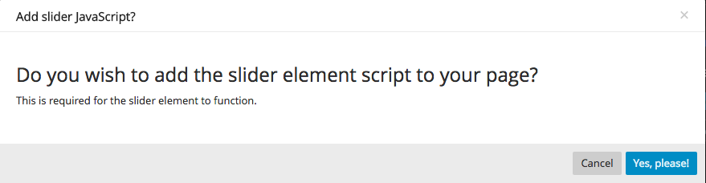

# Getting Started
All Pinegrow plugins are instantiated by calling a function, either anonymous or named, once the Pinegrow App signals it is ready. This function gets passed the event and the ```pinegrow``` window variable as arguments.
```javascript
$(function() {
    $('body').one('pinegrow-ready', function(e, pinegrow) {
        //plugin body
    });
});
```
or
```javascript
$(function() {
    $('body').one('pinegrow-ready', function(e, pinegrow) {
        myFunctionName(pinegrow);
    });
});
function myFunctionName(pinegrow){
    //plugin body
};
```
Within the body of the plugin, a new framework object is created using the ```PgFramework``` constructor and passing in a unique key that will be prefixed internally, along with a name for the framework.
```javascript
var framework = new PgFramework(key, name);
``` 
This framework variable can then be populated with a variety of key:value pairs. Some of these pairs are informational, like ```framework.author```, which will be displayed to the end user, or give parameters to the Pinegrow App about how the plugin is supposed to be managed or displayed. The most important of these are listed below in the section [**framework descriptive elements**](#fde). Other pairs add the individual library components, items to the property panel, or actions panel. The most important of these are listed below in the section [**framework helpers and constructors**](#fhc). A third category of key:value pairs control the actions of the CMS and are listed below in the section [**framework CMS helpers**](#fch).  
Typically, the descriptive key:value pairs for the framework are defined prior to returning the new object to the Pinegrow App using the ```addFramework()``` function.
```javascript
pinegrow.addFramework(framework);
```

<a name="fde"></a>
## Framework Descriptive Elements
___  
### __type__
This key takes a unique value identifying the framework - usually the same as the key passed into the framework, but can be used to delineate different versions of the same type. For example, all of the included versions of the Bootstrap framework has a type of 'bootstrap', but a key unique to their version - 'bs3.4.1' or 'bs4'. Defaults to the passed in key.
```javascript
framework.type = 'key';
```
### __allow_single_type__
This key takes a boolean value, usually "true", that prevents activation of multiple frameworks of the same type. Defaults to "false".
```javascript
framework.allow_single_type = true;
```
### __description__
This key takes an HTML string describing the plugin and can contain a link that is displayed when creating a new page using a template from the plugin.
```javascript
framework.description = '<a href="http://my.website.com/">Custom plugin</a> that adds a really neat framework';
```
### __author__
This key takes an HTML string with the author's name and is displayed when creating a new page using a template from the plugin.
```javascript
framework.author = '<em>Pinegrow</em>';
```
### __author_link__
This key takes a URL link that will be opened if the author name is clicked in the new page pop-up.
```javascript
framework.author_description = 'https://pinegrow.com';
```
### __info_badge__
This key takes a short string that will be displayed when creating a new page using a template from the plugin. This is useful for displaying version numbers, for example.
```javascript
framework.info_badge = 'v1.0.0';
```

Typical example of basic framework instantiation:
```javascript
$(function() {
    $('body').one('pinegrow-ready', function(e, pinegrow) {
		framework.type = 'pge';
		framework.allow_single_type = true;
		framework.description = '<a href="http://my.website.com/">Custom plugin</a> that adds a really neat framework';
		framework.author = '<em>Pinegrow</em>';
		framework.author_description = 'https://pinegrow.com';
		framework.info_badge = 'v1.0';

		var framework = new PgFramework('pge', 'Pinegrow Example');

    });
});
```
As shown below, this descriptor information will only be displayed when creating a plugin that adds a template for the user to select when starting a new page or project. It will not be displayed if the plugin only adds HTML snippets, actions, modifies workflow, or adds to the CMS. 


<a name="fhc"></a>
## Framework Helpers and Constructors
___  
Once your framework has been instantiated with descriptors there are a number of additional helpers and constructors made available through the API. Depending on the use-case only some of these may be needed. The most germane of these are listed below, with a short description of use case, arguments list, and example.  

### __addTemplateProjectFromResourceFolder ( template_folder, done, index, filter_func, skip_add_to_templates, absolute_folder )__
This function is used when constructing a plugin that provides one or more templates as a base for the user. For example, the stock Bootstrap 4 framework provides 19 starter templates when the user clicks on "New page or project".  
To utilize this in a plugin, create a folder that contains each HTML template file, potentially a CSS file with the same name as the accompanying template file, plus an additional subfolder that must be named screenshots and contain an image to display to the user. Each image must have the same name as the template file.  
The folder can also contain a subfolder of resources to be used with the templates.  
  
Arguments
- __template_folder__ - the source of the template folder relative to the main plugin file
- __done__ - typically passed null, takes a callback function that is triggered once the framework is created and is passed the framework as an argument	
- __index__ - determines the order of framework display - typically set to 100 or higher to add the plugin framework at the end
- __filter_func__ - receives a function that can edit the files added to the template - optional, usually not used
- __skip_add_to_template__ - optional, internal development use
- __absolute_folder__ - optional, internal development use 
   
  Typical usage:
 ```javascript
framework.addTemplateProjectFromResourceFolder('./template', null, 100);
```
  
### __ignore_css_files__
This key is used if the plugin is adding a template that includes customized CSS files that shouldn't be altered. It receives an array containing a single [regex string](https://developer.mozilla.org/en-US/docs/Web/JavaScript/Guide/Regular_Expressions) or multiple comma-separated regex strings. Any CSS file in the page resources that is matched by these string will be locked for editing.  
Single string
```javascript
framework.ignore_css_files = [/my_plugin_style\.css/i];
```
Multiple regex strings
```javascript
framework.ignore_css_files = [/my_plugin_style\.css/i, /my_other_styling\.css/i];
```
### __PgComponentTypeResource__ ( resource_url, code )
The PGComponentTypeResource constructor is used to add javascript and CSS files to a project. In addition to the two arguments that can be passed at instantiation, it can accept a number of additional key:value pairs.  

| key | value |
| ----| ---- |
| type | mime type - this allows the Pinegrow app to determine the correct way to embed the file on the HTML page, \<script> and src for JavaScript, or \<link> and href for CSS. Automatically set to correct mime type by lookup.
| detect | regex string - determine if another file (like jQuery), or an earlier version exists on the page -- typically not used |
| footer | boolean - determines whether the item should be added to the head (false) or the bottom of the body (true) -- default: false |
| project | internal use only |
| isFolder | boolean - used to indicate if the resource is a folder or not -- default: false|
| source | url - typically the same as the resource_url, in some cases need to be converted to system path seperators using the Node.js [path.sep](https://nodejs.org/api/path.html#path_path_sep) -- default: null|
| relative_url | resource file location relative to the template -- default: null |
|replace| boolean (or function returning boolean) If the ```detect``` key is used and a match is found then this indicates if the found resource should be replaced with the file at resource_url -- default: false -- typically used to determine if a resource needs to be replaced during an update|

Following creation and addition of key:value pairs, the new resource object is returned as a value to the framework in the ```resources``` key.
```javascript
framework.resources.add(new_resource)
```

Typical example code using file structure from above and including an example of using node.js ```path```.
```javascript
var path = require( 'path' );
var toLocalPath = function(file_path) {
    return file_path.replace(/\//g, path.sep)
};
var resource_files = [
		'css/my-style.css',
		'js/my-js.js'
	];
resource_files.forEach(function (resource_file) {
		var file = framework.getResourceFile('template/resources/' + resource_file);
		var resource = new PgComponentTypeResource(file);
		resource.relative_url = resource_file;
		resource.source = toLocalPath(file);
		resource.footer = resource_file.indexOf('.js') >= 0;
		resource.type = resource_file.indexOf('.js') >= 0 ? 'application/javascript' : 'text/css';
		framework.resources.add(resource);
	});
```
## Creating Components  
### Overview  
The ``` PgComponentType ``` constructor is the main way to add new snippets, property controls, and actions to the Pinegrow App. These objects can be broken down into three sections.
  1) A main body that contains key:value pairs that contain the optional HTML snippet, give information on how to identify the component for property controls or actions to target on the page, and data on how to display the element on the tree.  
  2) Sections identify one or more groups of property controls or actions
  3) Fields are individual property controls or actions
  
  How these components are added to the Pinegrow App depends on component type. For components that add property controls only, the component is added to the framework object using ```addComponentType```.
  ```javascript
  var my_property_control = new PgComponentType( 'pg_my_control', 'My Control, {...} );
  framework.addComponentType(my_property_control);
  ```
  
  Components that add reusable HTML snippets or actions require an additional constructor, ```PgFrameworkLibSection```. This constructor creates a new panel that can be displayed in the Library or Actions Tab. Components for each panel are identified by passing an array of components using ```setComponentTypes```. This object is then added to the framework object using either ```addLibSection``` to pass it to the Library tab, or ```addActionsSection``` to display it on the Actions Tab.  

  Library panel addition example
  ```javascript
  var pg_custom_lib_section = new PgFrameworkLibSection( 'pg_my_custom_section', 'My Custom Section');
  pg_custom_lib_section.setComponentTypes([my_custom_component_one, my_custom_component_two]);
  framework.addLibSection(pg_custom_lib_section);
  ```
  or  
  Action panel addition example
  ```javascript
  var pg_custom_action_section = new PgFrameworkLibSection( 'pg_my_custom_section', 'My Custom Section');
  pg_custom_lib_section.setComponentTypes([my_custom_component_one, my_custom_component_two]);
  framework.addActionsSection(pg_custom_action_section);
  ```

### PgComponentType(unique_id, display_name, {options} )
This constructor is passed three arguments.

 1) A unique id. It is best practice to add a plugin specific prefix to the id to minimize potential conflict with other plugins, e.g. pge_unique_id.
 2) A name that is displayed in the library or actions tab.
 3) An object that contains the HTML, controls, and or actions.

The options object can be further split into key:value pairs that provide the main body of the component, a section object that organizes all of the controls or actions, a set of field objects within the sections object that contain the key:value pairs that describe each control or action. Each component has a single set of main body options, but can have multiple sections with multiple fields each. 
 #### Main Body Key:Value Pairs
 ___  

**selector**  
This key receives either a CSS selector(s) or function that uniquely identifies the element being created or controlled. This key is required and is passed 'null' if the component does not need to be identified by Pinegrow - for example, a sub-component of a larger HTML element. When receiving a CSS selector, that selector is evaluated by Pinegrow to return a boolean value. Any function passed through the ```selector``` key should return a boolean.   
An example of a simple selector to target any page element with an attribute of 'pg-table'
```javascript
selector: '[pg-table]',
```  
An example targeting any element with a class of either 'container' or 'container-fluid'
```javascript
selector: '.container,.container-fluid',
```  
A example of a more complex selector using a javascript function. Note: the function can be passed a single argument that is conventionally named ```pgel```. This argument contains the source-code representation of the current DOM node (pgParserNode). This example function checks to see if the tag of the node is NOT 'html', 'body','head', or 'script'. As a side note, ```pgel.tagName``` will always return lowercase, irrespective of the case in the Document.
```javascript
selector: function(pgel) {
	if (['html', 'body', 'head', 'script'].includes(pgel.tagName)) {
		return false;
	} else {
		return true;
	}
}
```
**priority**  
Determines the order in which an action or property control component will display in the panel. The default is 1000. This key is optional.  

**code**  
This key receives any reusable snippet - HTML, Javascript, PHP. This key is optional. If you are putting together a component consisting of controls or actions only it doesn't need to be added.   
An example passing both HTML and PHP. 
```javascript
code: '<h2>The title of this article is <?php the_title(); ?>.</h2>',
```
**preview**  
This key receives a function that returns HTML representing what will be shown if the user hovers over the snippet in the library. This code is automatically generated from the ```code``` key:value pair. However, in the case of elements such as containers or rows it is useful to have a visual representation. This key is optional.
```javascript
Other component code...
    preview: getGridPreview(),
remainder of component code...

var getGridPreview = function() {
	var white = 'height: 20px;';
	var blue = 'height: 20px; background-color: #D8E5F2;';
		return '<div class="container-fluid" style="border:2px solid #0098cc; height: 120px;">\
			<div class="row">\
				<div style="' + white + '"></div>\
				<div style="' + blue + '"></div>\
				<div style="' + white + '"></div>\
			</div>\
			<div class="row">\
				<div style="' + white + '"></div>\
				<div style="' + blue + '"></div>\
				<div style="' + white + '"></div>\
			</div>\
		</div>';
	}
```
This code results in the following being displayed when the user hovers over the element in the Library panel.  
  
Note: If the ```code``` key has a value it will be appended to the preview HTML.  

**empty_placeholder**  
This key takes a boolean value. If true, it will insert a temporary placeholder element into the code until the user adds content. This is generally used for containers or rows to make them more easily dragged or targeted for editing.
 
**on_inserted**  
This key receives a function that is fired upon element insertion into the tree. This function takes two arguments, the DOM element and the page. One common use for this key is to display a message to the user or to refresh the page in the case of dynamic objects.  
```javascript
selector: '[slider]',
code: '...',
on_inserted: function(pgel, page) {
	crsaQuickMessage( 'Refresh page to see changes', 3000 );
},
...
```

**on_changed**  
This key receives a function that is fired upon alteration of the element. This function takes two arguments, the DOM element and the page. It will also fire if one of the element's decendents changes. One common use for this key is to display a message to the user or refresh the page in the case of dynamic objects.

**on_moved**  
This key receives a function that is fired upon element drag. This function receives three arguments. The first argument is the DOM element, the second is the original page location, and the third is the new location. This is an advanced key that is generally not used.  
#### Section Set-up 
___ 
The ```sections``` key receives an object of objects. Each object that it receives is a key:value pair with a unique name for key and an object for value. This object in turn has two required and one optional key:value pairs that define a set of controls. It is best practice to add a plugin-specific prefix to the unique name of each section to insure it doesn't conflict with another plugin.  

Basic ```section``` structure
```javascript
sections: {
	prefix_unique_name_one: {
		name: 'Displayed Section Name One',
		default_closed: true, \\optional
		fields:{...},
	},
	prefix_unique_name_two: {
		name: 'Displayed Section Name Two',
		default_closed: false, \\optional
		fields: {...},
	}
}
```  
Properties Panel from the above code when element is selected
  

#### Sections Key:Value pairs
___

 **name**  
 This key takes a name that will be displayed in the properties or actions panel. Note that alongside this name the Pinegrow App will list the source of the control or action. 

 **default_closed**  
 This key receives a boolean. If set to true, the resulting section will be closed by default on first display. This key is optional.  

 **fields**  
 This key is again an object of objects. Each individual object is a control or action.

 #### Fields Overview
 ___  
 Each field is a property control or action that modifies the element identified on the page by the main ```selector``` key. There are a number of built-in controls, such as checkboxes and drop-downs, but custom controls can also be built using API helpers. There are also several built-in actions, such as adding classes or attributes, but once again it is easy to build your own actions.  
 The ```fields``` key receives an object, that contains one or more individual field objects. Each individual field object has a unique name as key, with an object containing a number of key:value pairs.  
 Basic fields structure
 ```javascript
 fields: {
	 field_one: {
		 ...
	 },
	 field_two: {
		 ...
	 }
 }
 ```
 #### Fields Key:Value Pairs
 ___ 
 
**name**  
This value for this key will be displayed in either the properties or actions tab next to the control, e.g. "Add dividers?" or "Display".

 **type**  
 This key takes a value that tells Pinegrow what type of control to display. The Pinegrow API has five main types built in:  

 | Type | Output |
 |----|----|
 | checkbox| Displays a checkbox - basic boolean control
 | select | Displays a dropdown for selecting from a list of options - requires the options to be supplied either as an array of key:value objects, or as a function that returns the same
 | text | Displays a textbox to receive plain text/HTML/code
 | image | Displays a filepicker - can be used to select any file, not just images. For images it also displays a thumbnail
 |slider| displays a range slider for numerical input|

In addition to the built-in values, the ```type``` key can also accept a value of ```custom``` to allow the control to be defined either using the ```control``` or ```show``` keys. This will be further covered in the [custom controls](#ccs) section.  

#### Checkbox-specific key:value:pairs  
***
**value**  
This key takes a value that will be added or removed from the DOM element as class or attribute or custom value when the checkbox is ticked.

#### Select-specific key:value pairs
***
**options**  
This key supplies the list of choices to be displayed in the ```select``` dropdown list. They are supplied as an array of choices, where each choice is an object with at least two key:value pairs.  
   * name - this key takes a string that is displayed to the user in the select dropdown
   * key - this key takes a string that is the value returned when the user selects that option
```javascript
fields: {
	button_group_size {
		name: 'Button Size',
		type: 'select',
		options: [
			{key: 'btn-group-lg', name: "Large"},
			{key: 'btn-group-sm', name: "Small"},
			{key: 'btn-group-xs', name: "Extra small"}
		],
	}, 
}
```   
A third key ```html``` is used for making custom buttons and will be covered in the [custom controls](#) section. 

**toggle_buttons**  
This key takes a boolean value. If set to true it converts the dropdown list to side-by-side buttons. Reguires the use of the ```html``` key in the option list.

**show_empty**  
This key takes a boolean value. If true, it will allow the user to select an empty value, or no value, rather than one from the list. Depending on action or other keys, this can have the effect of removing a particular class or attribute from the DOM element.
#### Text-specific key:value pairs  
***
**live_update**  
This key takes a boolean value. If set to true, the targeted element will update in real-time as the user types. If set to false, the element will not update until the user hits enter.  

#### Image-specific key:value pairs  
***
**file_picker**  
This key takes a boolean value. If true it will display a folder icon at the right of the input box, along with a thumbnail if the selected file is an image.  

#### Slider-specific key:value pairs  
***
**slider_min**  
This key takes a value for the lower end of the slider range.  

**slider_max**  
This key takes a value for the upper end of the slider range.  

**slider_step**  
This key takes a value for the amount each tick of the slider should increment the value.  

**slider_def_unit**  
This key takes a string that indicates the type of unit the slider represents, e.g. 'px', 'ms', 'deg'  
***
***

**action**  
This key identifies what action Pinegrow should take when the user makes a selection with the control. It is used in conjunction with one or more additional keys

 * apply_class  
 	This ```action``` value indicates that the value being supplied from the control should either be added or removed as a class on the element. This value can be supplied from a dropdown using the ```options``` key, from the textbox of a ```text``` type input, or from the ```value``` key when using a ```checkbox``` type.  

 * element_attribute  
 This ```action``` value indicates that the value being supplied from the control should be either added or removed as an attribute of the element. This value can be supplied from the ```attribute``` key alone to produce an empty attribute, or a combination of the ```attribute``` key and ```select```, ```text```, ```image```, or ```slider``` user input.

  * custom  
  This ```action``` value indicates that a custom function, supplied by the ```set_value``` key, should be used to modify the selected element. Both ```set_value``` and ```get_value``` will be covered in the [custom actions](#cas) section.  

An example of the ```apply_class``` action. This example would add the ```btn-lg``` class to the selected element when the user ticks the checkbox.
```javascript
fields: {
	button_group_size {
		name: 'Make button large?',
		type: 'checkbox',
		action: 'apply_class',
		value: 'btn-lg'
	}, 
}
```
An example of the ```element_attribute``` action. This example will add the ```data-shipping``` attribute with a value supplied from a ```select``` dropdown.

```javascript
fields: {
	shipping_method: {
		name: 'Shipping method?',
		type: 'select',
		options: [
			{key: 'next-day', name: "Next Day"},
			{key: 'two-day', name: "2 day"},
			{key: 'standard', name: "Standard"}
		],
		action: 'element_attribute',
		attribute: 'data-shipping',
		empty_attribute: false
	}, 
}
```
**empty_attribute**  
This key takes a boolean value and determines whether or not the attribute being added to the DOM element requires a value. For example, in some cases an attribute of 'disabled' might be added to an element.  


#### Additional key:value pairs
---
**on_changed**  
This key takes a function that receives 9 arguments in order -  pgel, prop, value, oldValue, fieldDef, $field, eventType, fieldList, CrsaPage.
  * pgel  
  This argument is the pgParserNode (the source-code representation of the current DOM node) for the selected element.  
  * prop  
  This argument returns the field name of the control that changed. In the previous example this would be 'shipping_method'.
  * value  
  This argument returns the value that was selected by the user.
  * oldValue  
  This argument returns the previous value that the user had selected. If there was no previous selection it returns 'null'.
  * fieldDef  
  This argument returns the full field definition, including ```action``` type and ```name``` key:value pairs.
  * $field  
  This argument returns a jQuery element representing the field control. 
  * eventType
  This argument returns the type of event that triggered the ```on_changed``` function - typically 'changed'.
  * fieldList
  This argument returns an array of all the fields and field values for the section that the triggering field is included within.
  * CrsaPage
  This argument returns an array of values that represent the selected page options. This includes the file URL, page name, attached stylesheets, and breakpoints.

### Conditional Field Display

**show_if**
This key determines whether a particular field will be displayed. As values it can receive either a standard if conditional that references another field in the same section, or a function that can reference multiple fields or other values from the element and returns TRUE if it should be shown. Functions receive two arguments, values and pgel.
  * values
  This argument is an array of all the other fields in the section and their value.
  * pgel
  This argument is the pgParserNode (the source-code representation of the current DOM node) for the selected element.  
Examples 
```javascript
def.sections = {
    wp_site_options : {
        name : 'Options',
        fields : {
            field_1 : {
                ...
                type: 'checkbox',
                value: 'ON'
            },
            field_2 : {
                ...
                show_if: "field_1" //or
                show_if: "field_1==ON" //if has specific value, or
                show_if: function(values) { return values['field_1'] == 'ON' && values['another_field']; }// field_1 has specific value and another_field isn't null, or
				show_if: function(values, pgel) { return values['field_1'] == 'ON' && pgel.hasAttr('data-name')}
            }
         }
    }
}
```

<a name="ccs"></a>
## Custom Controls

#### PgToggleButtonMaker()
#### makeIcon
#### on_define
#### on_show
#### registerInputField
#### showInputField
#### createFieldDef
<a name="cas"></a>
## Custom Actions
___
Overview  
Custom actions do more to manipulate the DOM than adding a simple class or attribute. For example they can set multiple attributes and values at the same time, or add a class to a parent element in the DOM at the same time as adding one to the selected elements. They are added through the ```get_value``` and ```set_value``` keys, with the ```action``` key set to ```custom```.

### get_value
This key recieves a function as a value. This function receives a single argument, ```pgel```, which is the pgParserNode (the source-code representation of the current DOM node) for the selected element. This function should return the current value that the control should display based on the current state of the DOM with respect to the control field. For example, if the custom control adds an attribute to the parent element, the ```get_value``` key function should fetch and examine the parent element and return "true" if the attribute is present. Depending on the type of control, the value that is returned will need to be different.
|type|returned value|
|---|---|
checkbox | true/1 or null/false/0
select | key
### set_value


## Additional Helpers
___
### pinegrow.getCurrentProject()
This helper function returns an array of key:value pairs with information about the current project, including project folder URL. If the current page is not part of a project it returns 'null'. This helper is useful to test whether the current page is part of a project before trying to add resources.
### pinegrow.getSelectedPage()
This helper function returns the CrsaPage variable for the current page, which contains an array of key:value pairs with information such as breakpoints and page file URL.
### crsaQuickMessage( HTML, duration, single, error)
This helper allows the display of a message to the user. It is usually triggered by the```on_inserted``` or ```on_changed``` keys.
  * HTML
  This argument receives an HTML or plain text string to display to the user
  * duration
  This argument receives the number of ms to display the message. Note: this will block any interaction with the Pinegrow App for the duration of the message.
  * single
  This argument receives a boolean value and is optional. Generally only passed in if also passing a value to error. Has no impact on message display.
  * error
  This argument receives a boolean value and is optional. If 'true' then the message modal will receive an orange border.

### pinegrow.showAlert(HTML, title, button_one_msg, button_two_msg, button_one_func, button_two_func)
This helper function receives up to 6 arguments (all technically optional) and opens a modal that collects user input. It can display up to two buttons, each with a different function.
  * HTML
  This argument receives an HTML or plain text string to display as the body text of the modal. Optional and defaults to an empty string if null is passed.
  * title
  This argument receives an HTML or plain text string to display as the title for the modal. Optional and defaults to 'Notice' if null is passed.
  * button_one_msg
  This argument receives an HTML or plain text string to display as the first button text. Optional and defaults to 'OK' if null is passed.
  * button_two_msg
  This argument receives an HTML or plain text string to display as the second button text. Optional with no button displayed if passed null.
  * button_one_func
  This argument receives a function that is fired if the user clicks button number one. Optional and defaults to null if not passed. If the button is used to cancel any changes and close the modal and a second button with function is being passed, this argument should be passed 'null'.
  * button_two_func
  This argument receives a function that is fired if the user clicks button two. Optional and defaults to null if not passed.
  ```javascript
  var $html = $('<h3>Do you wish to add the slider element script to your page?</h3>\
  <p>This is required for the slider element to function.</p>');
  pinegrow.showAlert ($html, 'Add slider JavaScript?', 'Cancel', 'Yes, please!', null, function(){addScript();});
  ```
  

### pinegrow.getPlaceholderImage()
This helper will return a random image from the pinegrow server to serve as a placeholder in any image element. Note, this will only work if the user is connected to the internet.

<a name="mc"></a>
## Menu Helpers 
___ 
There are two major ways to add new menu items through the Pinegrow API. The first allows for addition of new menu items to the "Page" main menu using the framework key ```on_page_menu``` and passing in the menu items. The second allows for the addition of an entirely new menu using the ```addPluginControlToTopbar()``` helper function.

### .on_page_menu(page, items)  
As described above, this key is used for inserting additional items into the "Page" menu. The additional items will be added after the "Manage Google Fonts..." menu item and will only be visible when a page is opened in the editor. This key receives a function that is passed two arguments, ```page``` and ```items```.  
The ```items``` argument is an array of objects containing the items to be added to the menu. There are three different objects that ```items``` accepts.  

 1) An object with a single key:value pair  
 ```type: 'divider'```   
 This object adds a horizontal divider in the dropdown menu.
 
 2) An object that adds a header with two key value pairs:  
 ```type: 'header',```  
 ```label: 'Any string'```  
 This object will cause Pinegrow to add a non-clickable header to  the dropdown menu using the string passed as the ```label``` value.
 3) An object with up two key:value pairs:  
 ```label: 'Any string',```  
 ```action: function(){/*action to be performed when item is selected}```  
 This object will display the ```label``` key value in the menu and execute the function passed in the ```action``` key value when the user clicks the menu item. 
 Simple menu example
 ```javascript
 framework.on_page_menu = function (page, items) {
	 items.push({
		 type: 'divider'
	 });

	 items.push({
		 type: 'header',
		 label: 'New Menu'
	 });

	 items.push({
		 label: 'Menu Item One',
		 action: function() {
			 customFunction()
		 }
	 })
 }
 ```

## addPluginControlToTopbar( framework, $control, show_always, func)
This helper will create a new menu and insert it prior to the "Support" menu in the main header. It accepts four arguments, with the first two being required and the second two optional.  

### framework
The first argument is simply the framework object that we instantiated in our plugin. It defaults to "f" and is required.  

### $control  
The second argument is the actual menu HTML and is required. It should be passed as a jQuery element. Each of the dropdown menus are individual ```<li>``` items. The menu is styled and enabled using Bootstrap 4 classes and toggles.  
Simple menu example  
```javascript
var $control = $('
    <li id="example-menu" class="dropdown">
        <a href="#" class="dropdown-toggle" data-toggle="dropdown"><span>New Menu Title</span></a>
        <ul class="dropdown-menu">
            <li><a href="#" id="item-one">Menu Item One</a></li>
            <li><a href="#" id="item-two">Menu Item Two</a></li>
        </ul>
    </li>
');
```
The next two keys work in tandem. One or both arguments must evaluate to true in order to display the new menu.
### show_always  
This argument takes a boolean value. If true, then the menu will be displayed whenever the framework is loaded, irrespective of page or project. Note, this is accomplished through appending the ```$control``` to the editor through jQuery manipulation. If this function is called to early in the load there will be an error due to the targeted on page element not existing. 

### func
This argument takes a function that evaluates whether the menu should be loaded and should return a boolean value. 

Overall, the ```addPluginControlToTopbar``` should be used in conjunction with one of thePinegrow hooks to ensure proper loading. See the [hooks](#hs) section for details.

## Framework Hooks

### on_project_loaded()
This key takes a function as value and calls the supplied function when a project with the plugin activated is loaded.
### on_page_loaded
This key takes a function as value and calls the supplied function when a page with the plugin activated is loaded.
### on_page_saved
This key takes a function as value and calls the supplied function when a page with the plugin activated is saved.
### on_page_changed
This key takes a function as value and calls the supplied function when a page with the plugin activated is changed.
### on_page_closed
This key takes a function as value and calls the supplied function when a page with the plugin activated is closed.
### ?on_build_actions_menu
### ?on_element_inserted
?
  