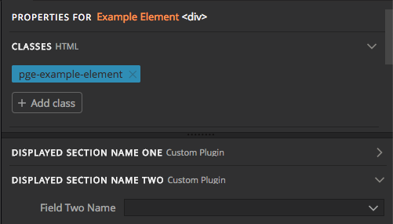

## Overview  

Sections and fields are passed as component keys following the main body keys in the ```PGComponentType``` options. They add and organize controls for components and are optional if the component adds only an HTML snippet. Each section organizes a group of fields on either the Property or Actions tab of the Pinegrow Editor. Each field, in turn, encodes the control activity.  

---
### Section Set-up 
The ```sections``` key receives an object of objects. Each object that it receives is a key:value pair with a unique name for key and an object for value. This object in turn has two required and one optional key:value pairs that define a set of controls. It is best practice to add a plugin-specific prefix to the unique name of each section to insure it doesn't conflict with another plugin.  

Basic ```section``` structure
```javascript
sections: {
	prefix_unique_name_one: {
		name: 'Displayed Section Name One',
		default_closed: true, \\optional
		fields:{...},
	},
	prefix_unique_name_two: {
		name: 'Displayed Section Name Two',
		default_closed: false, \\optional
		fields: {...},
	}
}
```  
Properties Panel from the above code when element is selected  
  
  

#### Sections Key:Value pairs
___

 **name**  
 This key takes a name that will be displayed in the properties or actions panel. Note that alongside this name the Pinegrow App will list the source of the control or action. 

 **default_closed**  
 This key receives a boolean. If set to true, the resulting section will be closed by default on first display. This key is optional.  

 **fields**  
 This key is again an object of objects. Each individual object is a control or action.

 ### Fields Overview
 ___  
 Each field is a property control or action that modifies the element identified on the page by the main ```selector``` key. There are a number of built-in controls, such as checkboxes and drop-downs, but custom controls can also be built using API helpers. There are also several built-in actions, such as adding classes or attributes, but once again it is easy to build your own actions.  
 The ```fields``` key receives an object, that contains one or more individual field objects. Each individual field object has a unique name as key, with an object containing a number of key:value pairs.  
 Basic fields structure
 ```javascript
 fields: {
	 field_one: {
		 ...
	 },
	 field_two: {
		 ...
	 }
 }
 ```
 #### Fields Key:Value Pairs
 ___ 
 
**name**  
This value for this key will be displayed in either the properties or actions tab next to the control, e.g. "Add dividers?" or "Display".

 **type**  
 This key takes a value that tells Pinegrow what type of control to display. The Pinegrow API has five main types built in:  

 | Type | Output |
 |----|----|
 | checkbox| Displays a checkbox - basic boolean control
 | select | Displays a dropdown for selecting from a list of options - requires the options to be supplied either as an array of key:value objects, or as a function that returns the same
 | text | Displays a textbox to receive plain text/HTML/code
 | image | Displays a filepicker - can be used to select any file, not just images. For images it also displays a thumbnail
 |slider| displays a range slider for numerical input|

In addition to the built-in values, the ```type``` key can also accept a value of ```custom``` to allow the control to be defined either using the ```control``` or ```show``` keys. This will be further covered in the [custom controls](Custom%20Controls.md) section.  

#### Checkbox-specific key:value:pairs  
***
**value**  
This key takes a value that will be added or removed from the DOM element as class, attribute, or custom value when the checkbox is ticked.

#### Select-specific key:value pairs
***
**options**  
This key supplies the list of choices to be displayed in the ```select``` dropdown list. They are supplied as an array of choices, where each choice is an object with at least two key:value pairs.  
   * name - this key takes a string that is displayed to the user in the select dropdown
   * key - this key takes a string that is the value returned when the user selects that option
```javascript
fields: {
	button_group_size {
		name: 'Button Size',
		type: 'select',
		options: [
			{key: 'btn-group-lg', name: "Large"},
			{key: 'btn-group-sm', name: "Small"},
			{key: 'btn-group-xs', name: "Extra small"}
		],
	}, 
}
```   
A third key ```html``` is used for making custom buttons in conjunction with the ```toggle_buttons``` key and will be covered in the [custom controls](Custom%20Controls.md) section. 

**show_empty**  
This key takes a boolean value. If true, it will allow the user to select an empty value, or no value, rather than one from the list. Depending on action or other keys, this can have the effect of removing a particular class or attribute from the DOM element.
#### Text-specific key:value pairs  
***
**live_update**  
This key takes a boolean value. If set to true, the targeted element will update in real-time as the user types. If set to false, the element will not update until the user hits enter.  

#### Image-specific key:value pairs  
***
**file_picker**  
This key takes a boolean value. If true it will display a folder icon at the right of the input box, along with a thumbnail if the selected file is an image.  

#### Slider-specific key:value pairs  
***
**slider_min**  
This key takes a value for the lower end of the slider range.  

**slider_max**  
This key takes a value for the upper end of the slider range.  

**slider_step**  
This key takes a value for the amount each tick of the slider should increment the value.  

**slider_def_unit**  
This key is optional and takes a string that indicates the type of unit the slider represents, e.g. 'px', 'ms', 'deg'  
***

**action**  
This key identifies what action Pinegrow should take when the user makes a selection with the control. It is used in conjunction with one or more additional keys

 * apply_class  
 	This ```action``` value indicates that the value being supplied from the control should either be added or removed as a class on the element. This value can be supplied from a dropdown using the ```options``` key, from the textbox of a ```text``` type input, or from the ```value``` key when using a ```checkbox``` type.  

 * element_attribute  
 This ```action``` value indicates that the value being supplied from the control should be either added or removed as an attribute of the element. This value can be supplied from the ```attribute``` key alone to produce an empty attribute, or a combination of the ```attribute``` key and ```value``` key or ```select```, ```text```, ```image```, or ```slider``` user input.

  * custom  
  This ```action``` value indicates that a custom function, supplied by the ```set_value``` key, should be used to modify the selected element. Both ```set_value``` and ```get_value``` will be covered in the [custom actions](Custom%20Controls.md#cas) section.  

An example of the ```apply_class``` action. This example would add the ```btn-lg``` class to the selected element when the user ticks the checkbox.
```javascript
fields: {
	button_group_size {
		name: 'Make button large?',
		type: 'checkbox',
		action: 'apply_class',
		value: 'btn-lg'
	}, 
}
```
An example of the ```element_attribute``` action. This example will add the ```data-shipping``` attribute with a value supplied from a ```select``` dropdown.

```javascript
fields: {
	shipping_method: {
		name: 'Shipping method?',
		type: 'select',
		options: [
			{key: 'next-day', name: "Next Day"},
			{key: 'two-day', name: "2 day"},
			{key: 'standard', name: "Standard"}
		],
		action: 'element_attribute',
		attribute: 'data-shipping',
		empty_attribute: false
	}, 
}
```
**empty_attribute**  
This key takes a boolean value and determines whether or not the attribute being added to the DOM element requires a value. For example, in some cases an attribute of 'disabled' might be added to an element.  


#### Additional key:value pairs
---
**on_changed**  
This key takes a function that receives 9 arguments in order -  pgel, prop, value, oldValue, fieldDef, $field, eventType, fieldList, CrsaPage.
  * __pgel__  
  This argument is the pgParserNode (the source-code representation of the current DOM node) for the selected element.  
  * __prop__  
  This argument returns the field name of the control that changed. In the previous example this would be 'shipping_method'.
  * __value__  
  This argument returns the value that was selected by the user.
  * __oldValue__	  
  This argument returns the previous value that the user had selected. If there was no previous selection it returns 'null'.
  * __fieldDef__  
  This argument returns the full field definition, including ```action``` type and ```name``` key:value pairs.
  * __$field__  
  This argument returns a jQuery element representing the field control. 
  * __eventType__  
  This argument returns the type of event that triggered the ```on_changed``` function - typically 'changed'.
  * __fieldList__  
  This argument returns an array of all the fields and field values for the section that the triggering field is included within.
  * __CrsaPage__  
  This argument returns an array of values that represent the selected page options. This includes the file URL, page name, attached stylesheets, and breakpoints.

### Conditional Field Display

**show_if**  
This key determines whether a particular field will be displayed. It can receive as values either a standard if conditional that references another field in the same section, or a function that can reference multiple fields or other values from the element and returns TRUE if it should be shown. Functions receive two arguments, values and pgel.
  * __values__  
  This argument is an array of all the other fields in the section and their value.
  * __pgel__  
  This argument is the pgParserNode (the source-code representation of the current DOM node) for the selected element.  
Examples 
```javascript
def.sections = {
    wp_site_options : {
        name : 'Options',
        fields : {
            field_1 : {
                ...
                type: 'checkbox',
                value: 'ON'
            },
            field_2 : {
                ...
                show_if: "field_1" //or
                show_if: "field_1==ON" //if has specific value, or
                show_if: function(values) { return values['field_1'] == 'ON' && values['another_field']; }// field_1 has specific value and another_field isn't null, or
                show_if: function(values, pgel) { return values['field_1'] == 'ON' && pgel.hasAttr('data-name')}
            }
         }
    }
}
```  
Next: [Custom Actions](Custom%20Actions.md)
