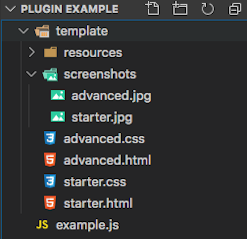

# Adding Templates and Resources
## Overview
Plugins can optionally offer base templates or resources to the user. This can include HTML and JavaScript files, for example. These resources are copied from the plugin either upon activation or when the page is saved as a project. 

### __addTemplateProjectFromResourceFolder ( template_folder, done, index, filter_func, skip_add_to_templates, absolute_folder )__
This function is used when constructing a plugin that provides one or more templates as a base for the user. For example, the stock Bootstrap 4 framework provides 19 starter templates when the user clicks on "New page or project".  
To utilize this in a plugin, create a folder that contains each HTML template file plus an additional subfolder that must be named "screenshots" and contain an image that is typically a screenshot of that template to display to the user. Each image must have the same name as the template file. Any other files that should be included when the template is saved as a project should also be in this folder. If desired, additional resources can be placed into a sub-folder(s).  

Example template folder structure:  

  
Arguments
- __template_folder__ - the source of the template folder relative to the main plugin file - Note: if the folder is at the same level as the main plugin file you do not need to prefix with './' to search in the current directory.
- __done__ - typically passed null, takes a callback function that is triggered once the framework is created and is passed the framework as an argument  
- __index__ - determines the order of framework display - typically set to 100 or higher to add the plugin framework at the end
- __filter_func__ - receives a function that can edit the files added to the template - optional, typically used when adding multiple templates, each with specific resources
- __skip_add_to_template__ - optional, internal development use
- __absolute_folder__ - optional, internal development use 
   
  Simple usage:
 ```javascript
framework.addTemplateProjectFromResourceFolder('template', null, 100);
```  
Advanced usage - In this example there are template specific files that should only be added if a template requires that particular file.

  
### __ignore_css_files__
This key is used if the plugin is adding a template that includes customized CSS files that shouldn't be altered. It receives an array containing a single [regex string](https://developer.mozilla.org/en-US/docs/Web/JavaScript/Guide/Regular_Expressions) or multiple comma-separated regex strings. Any CSS file in the page resources that is matched by these string will be locked for editing.  
Single string
```javascript
framework.ignore_css_files = [/my_plugin_style\.css/i];
```
Multiple regex strings
```javascript
framework.ignore_css_files = [/my_plugin_style\.css/i, /my_other_styling\.css/i];
```
### __PgComponentTypeResource__ ( resource_url, code )
The PGComponentTypeResource constructor is used to add javascript and CSS files to a project. In addition to the two arguments that can be passed at instantiation, it can accept a number of additional key:value pairs.  

| key | value |
| ----| ---- |
| type | mime type - this allows the Pinegrow app to determine the correct way to embed the file on the HTML page, \<script> and src for JavaScript, or \<link> and href for CSS. Automatically set to correct mime type by lookup.
| detect | regex string - determine if another file (like jQuery), or an earlier version exists on the page -- typically not used |
| footer | boolean - determines whether the item should be added to the head (false) or the bottom of the body (true) -- default: false |
| project | internal use only |
| isFolder | boolean - used to indicate if the resource is a folder or not -- default: false|
| source | url - typically the same as the resource_url, in some cases need to be converted to system path seperators using the Node.js [path.sep](https://nodejs.org/api/path.html#path_path_sep) -- default: null|
| relative_url | resource file location relative to the template -- default: null |
|replace| boolean (or function returning boolean) If the ```detect``` key is used and a match is found then this indicates if the found resource should be replaced with the file at resource_url -- default: false -- typically used to determine if a resource needs to be replaced during an update|

Following creation and addition of key:value pairs, the new resource object is returned as a value to the framework in the ```resources``` key.
```javascript
framework.resources.add(new_resource)
```

Typical example code using file structure from above and including an example of using node.js ```path```.
```javascript
var path = require( 'path' );
var toLocalPath = function(file_path) {
    return file_path.replace(/\//g, path.sep)
};
var resource_files = [
		'css/my-style.css',
		'js/my-js.js'
	];
resource_files.forEach(function (resource_file) {
		var file = framework.getResourceFile('template/resources/' + resource_file);
		var resource = new PgComponentTypeResource(file);
		resource.relative_url = resource_file;
		resource.source = toLocalPath(file);
		resource.footer = resource_file.indexOf('.js') >= 0;
		resource.type = resource_file.indexOf('.js') >= 0 ? 'application/javascript' : 'text/css';
		framework.resources.add(resource);
	});
```

Next: [Components](Components.md)